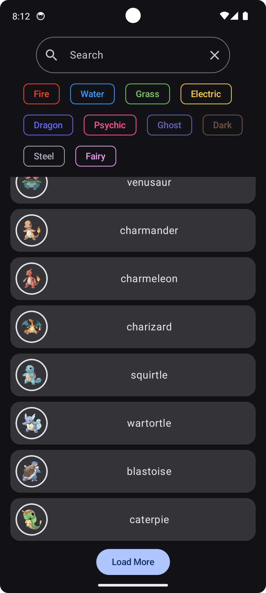
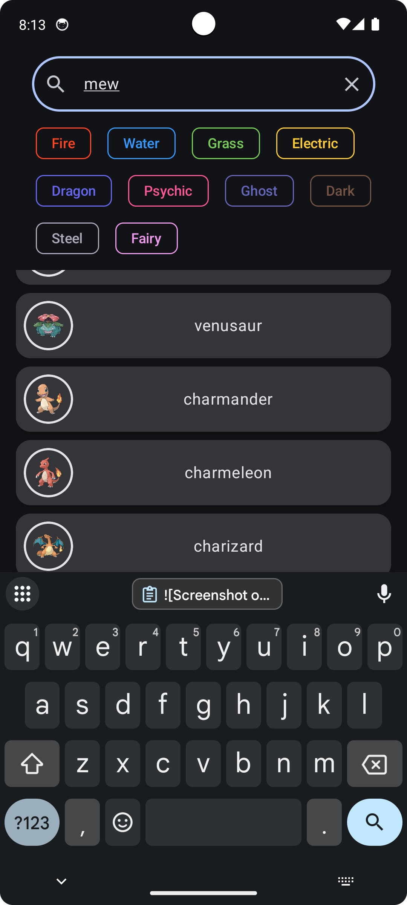
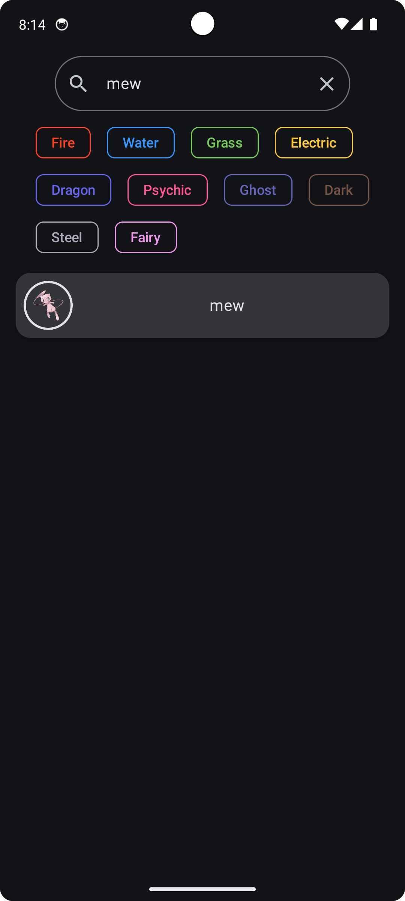
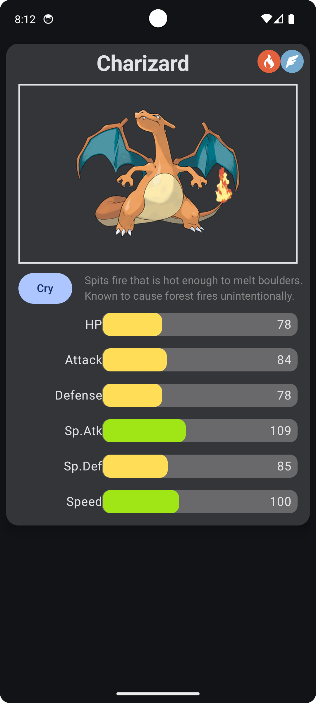
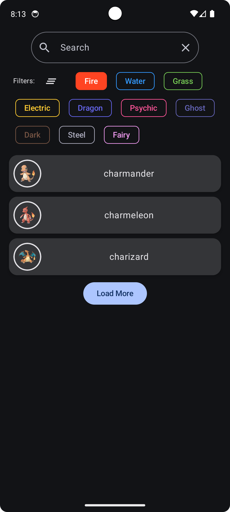
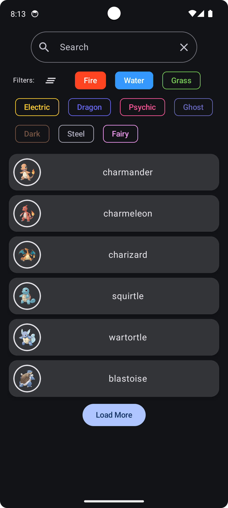

# Pokemon Explorer App

## Description

A Pokemon app that allows you to search and explore Pokemon by name.
Load a list of Pokemon via a button and filter them by type. Supports up to 10 types. 
Uses MVVM architecture and Dependency Injection. 

## Key Features

* Search and Explore Pokemon by Name
* Load more Pokemon via Button
* Filter Pokemon by Type
* Display Pokemon Details(Name, Type, Stats, PokeDex Text)
* Display Pokemon Image
* Hear Pokemon latest cry
* ...

## Tech Stack

* Kotlin
* Android Jetpack Compose
* Jetpack Navigation
* Architecture Components ( ViewModel.)
* Hilt (for Dependency Injection)
* Retrofit (for Networking)
* Gson (for JSON Parsing)
* Kotlin Coroutines and Flow
* Animation and Transition Library
* Mockito for Unit Testing

## Architecture Decisions

**Model-View-ViewModel (MVVM)
  > The app follows the Model-View-ViewModel (MVVM) architecture to ensure a clear separation of concerns. The View (Compose UI) observes the ViewModel, which prepares and holds the data. The Model layer handles data retrieval (Repository) and data sources (RemoteDataSource). This improves testability, maintainability, and code organization.

**Dependency Injection with Hilt
  > Hilt was chosen as the dependency injection framework to simplify the management of dependencies throughout the application. It leverages Dagger under the hood and provides a standard way to incorporate DI into Android apps, reducing boilerplate and improving testability.

**Asynchronous Operations with Kotlin Coroutines and Flow
  > Kotlin Coroutines and Flow are used extensively for handling asynchronous operations, such as network requests. Flow provides a reactive stream of data that can be observed by the UI, making it suitable for handling data that changes over time. Coroutines simplify writing asynchronous code in a sequential and readable manner.

**Networking with Retrofit
  > Retrofit was selected as the HTTP client due to its ease of use and integration with Kotlin and Moshi/Gson for handling API communication and data serialization/deserialization. Its declarative approach makes defining API endpoints straightforward.

**UI Layer with Jetpack Compose
  > Jetpack Compose is used for building the user interface with a declarative and reactive approach. It simplifies UI development, reduces the amount of boilerplate code, and allows for more dynamic and interactive UIs.
  

## Installation
Clone the repository and hit Build on the App module.

## Usage
Load initial first page of 10 Pokemon when it opens.
Load More via clicking the button to fetch the next 10 Unfiltered Pokemon.
View Details via clicking a pokemon card in the list.
Type a name and search locally by selecting a filter.
Type a name and search remotely by clicking the Search button on the keyboard.(Requires Full Pokemon Name)
Clear filters to load all Pokemon. Clearing query name applies filters again 
If selected a type and then Load More, it fetches the next page, and then filters by that type.
Pokemon will appear if the next page includes Pokemon of that type.
Searching by name requires full name and if any filters are on, make sure it is the correct type.
Pokemon Details: Name, Types, Stats, PokeDex Text, Image, Latest Cry.
Search tips: To search mega evolutions use <pokemon>-<mega>-<x|y> e.g charizard-mega-x
To search gigantamax use <pokemon>-<gmax> e.g pikachu-gmax

Limitations: Api does not support partial name search.
